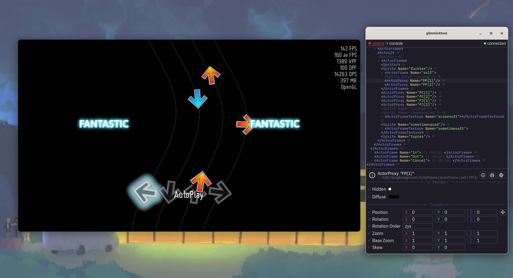

# gimmicktool

Interactive cross-platform external NotITG inspector and debugger. Like browser
devtools, but for NotITG

gimmicktool is _extremely unstable_ and _non-production ready_ software. You
should consider it a proof-of-concept more than anything, even if the intent is
to become a full desktop app sometime down the line.

## About

gimmicktool is made with [Tauri](https://tauri.app), which creates a webview for
the UI and uses Rust as the backend. The webview is made with your system's
provided webview:
- On Windows, this is the Microsoft Edge WebView2 (Chromium)
- On macOS, this is Safari (WebKit)
- On Linux, this is GNOME Web (Also known as "Epiphany"; WebKit)

The Rust backend manages handling the [Sometsuki protocol](#protocol): attaching
to the NotITG process, reading/writing to the external memory block, and parsing
and serializing messages. The frontend handles everything else.

The bottleneck of the protocol will always be NotITG - gimmicktool attempts to
poll NotITG memory at 240hz, which should be more than enough for realtime
communication, but NotITG can only poll at your framerate, so if you use VSync
or are using it in combination with a particularly laggy setup, you may end up
with very throttled throughput.

## Build

Pre-built binaries are not currently available. Not only is it a hassle to get
built binaries for all three platforms, gimmicktool should currently only be
used for development purposes.

0. Install Rust, pnpm and the [prerequisites listed for your platform on the
   Tauri docs](https://tauri.app/start/prerequisites/#linux). Clone this
   repository.
1. Run `pnpm install` to install pnpm dependencies
   
   > If you're like me, and store git repositories in a directory named
   > `projects`, pnpm will mistake this for a monorepo projects directory and
   > start scanning every single entry in it. Pass `--ignore-workspace` for it
   > to not do this.
2.
   - For development:
     - Run `RUST_LOG=trace pnpm tauri dev`. This will rebuild the Rust side if it
     gets changed, and refresh the webview when the web code gets changed.

        > On macOS, a [cargo config](./src-tauri/.cargo/config.toml) runs a
        > script before `cargo run` to sign the binary, as unsigned binaries
        > without `com.apple.security.cs.debugger` are not allowed to read/write
        > to other processes' memory. **This may not work on your machine** as
        > I've only tested this on my Intel macOS 11.7 test machine (notably,
        > I've heard reports M1 Macs are more strict about this).
   - For production:
     - Consult the [Tauri distribution documentation](https://tauri.app/distribute/). Though, generally:
       - On Windows, run `pnpm tauri build --no-bundle`. The binary will be in
         `src-tauri/target/release/gimmicktool.exe`.
       - On macOS, run `pnpm tauri build --bundles app`. This will produce an
         .app in `src-tauri/target/release/bundle/gimmicktool.app`.

         > macOS bundles will also be signed (with only ad-hoc signing for now
         > as I do not have 100$/yr to give to Apple). **This step cannot be
         > skipped**, as otherwise macOS will not give gimmicktool permission to
         > read/write NotITG memory.
         >
         > As signing is only ad-hoc, you will likely need to [whitelist the app
         > in your settings](https://support.apple.com/en-gb/guide/mac-help/mh40616/mac).
       - On Linux, run `pnpm tauri build --no-bundle`. The binary will be in
         `src-tauri/target/release/gimmicktool`.

## Use

First, get a Sometsuki-compatible Get/SetExternal receiver that implements
gimmicktool's messages on your NotITG installation. In the future, a Mirin
plugin is planned to be made for easier use, but currently the only
implementation is the one in the [gimmicktool branch of the gimmick!
theme](https://github.com/femboyindustries/gimmick-theme/tree/gimmicktool).

At least NotITG v4.9 is required - while gimmicktool itself does not strictly
require it and supports v4.2 onwards, a lot of the actual functionality as
implemented by the receiver requires v4.9 features.

Afterwards, [build gimmicktool](#build) and run it. If everything goes well,
gimmicktool should recognize the open NotITG instance and attach to it.

> [!NOTE]
> If the receiver is not setup properly, then the connection will time out
> (error `connection timeout`), as gimmicktool will write to the external buffer
> and get stuck waiting on a response.

> [!WARNING]
> On macOS, if the building was done correctly, output .apps should just run,
> bringing up a password prompt when attempting to attach to the process.
> Otherwise, you may need to disable SIP, run gimmicktool as `sudo`, or do both.

> [!WARNING]
> On Linux, you may need to first run `sudo sysctl -w
> kernel.yama.ptrace_scope=0` to lift the kernel's process memory restrictions.

## Protocol

Gimmicktool uses the **Sometsuki** two-way communication protocol, invented for
this project and named after the [ultra violet
protagonist](https://ynfg.yume.wiki/Sometsuki).

Sometsuki is a light and simple protocol, with the intent of being usable by any
other tool that intends to hook into the game with Get/SetExternal calls.
However, it is also as unstable as gimmicktool itself - the specification may
and will change without warning.

The protocol is documented in [SOMETSUKI.md](./SOMETSUKI.md).

The messages that gimmicktool uses for its functionality will likely remain
undocumented, however. These include the messages used for actor tree polling,
console evaluation and reading, etc.
